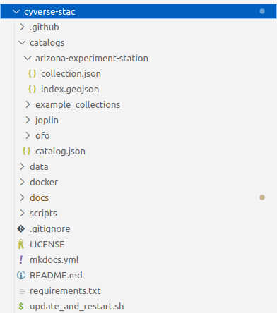

On the `stac-api` vm, the github repo [https://github.com/cyverse-gis/cyverse-stac](https://github.com/cyverse-gis/cyverse-stac){target=_blank} has been cloned to the vm directory `/home/ubuntu/cyverse-stac`. Editing or adding new content to the API is done through this repo in Github.

<figure markdown>
  { width="400" }
  <figcaption> </figcaption>
</figure>

To add new collections to the API, you would add a new directory under `/catalogs`. Within this new directory you would add a
`collection.json` file and `index.geojson` file that were created by the `STAC_creation_latest.ipynb`. 

Additionally, you will need to edit `ingest_cyverse.py` file found at `/scripts` within the repo. 

This edits should be done in the Github repo, not on the vm. 

<br/>

Changes that you make to the github repo will be pulled into the vm automatically. This is accomplished by using a cronjob. There is shell script called `update_and_restart.sh` in the repo that specifies: 1. Look for differences between github repo and repo on vm. 2. If there are differences, then pull the changes from github. 3. Restart the docker-compose that creates the STAC API. On the vm, the shell script has been programmed to run every 5 minutes using the crontab. 

While logged into the `stac-api` vm:
```
cd /home/ubuntu/stac-fastapi/

# To edit the crontab
crontab -e

#The command to run the shell script every 5 minutes and output results to log file
*/5 * * * * /home/ubuntu/stac-fastapi/update_and_restart.sh >> /home/ubuntu/cyverse-stac/cron_log_file.log 2>&1
```
<br/><br/>

If the cronjob is not working, then you can log into the `stac-api` vm and do things manually
```
cd /home/ubuntu/cyverse-stac
git pull
```
<br/>

```
cd /home/ubuntu/stac-fastapi/
docker-compose restart
```

<br/>

If the restart doesn't work, then you can try to stop and start the docker-compose
``` 
cd /home/ubuntu/stac-fastapi/
docker-compose down
docker-compose up -d
```
